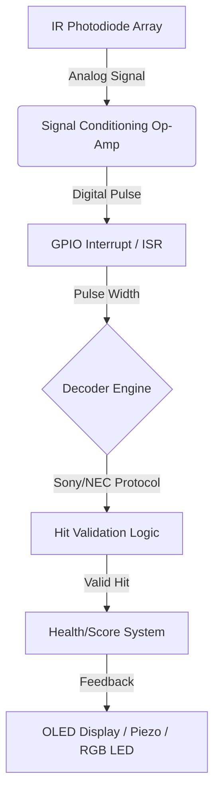

# 🎯 OpenLTS: Tactical Laser Target System (ESP8266 / AVR)

> **DIY Tactical Laser Tag Receiver** | **Electronic Warfare Training** | **Signal Processing**

## 📖 About
**OpenLTS (Laser Target System)** is a high-performance, open-source firmware designed for **ESP8266** and **Atmega328P** microcontrollers. Optimized for **tactical laser tag**, **mil-sim training**, and **optical target acquisition**, this project implements robust signal processing algorithms to decode modulated IR signals (NEC, RC5, Sony) even in high-noise environments (direct sunlight).

Whether you are building a **smart target**, a **hostage rescue scenario prop**, or testing **IR countermeasure (IRCM)** equipment, OpenLTS provides the millisecond-level response time required for realistic combat simulation.

### 🏷️ Topics
`esp8266-laser-tag` `ir-receiver` `tactical-training` `electronic-warfare-sim` `mil-sim` `arduino-target` `signal-processing` `twinsglow-compatible`

---

## 🏗️ Technical Architecture

The firmware utilizes a non-blocking, interrupt-driven state machine to handle IR pulse streams while maintaining high-speed IO for audio/visual feedback.

## 🔌 Hardware Pinout (ESP8266 / D1 Mini)

| Component | ESP8266 Pin | Function | Notes |
| :--- | :--- | :--- | :--- |
| **IR Receiver** | D2 (GPIO 4) | `IR_RX_PIN` | Use 38kHz demodulator (VS1838B) for basic usage. |
| **Piezo Buzzer** | D5 (GPIO 14) | `TONE_PIN` | 100Ω resistor recommended. |
| **Hit LED** | D6 (GPIO 12) | `LED_HIT_PIN` | Active HIGH. |
| **Mode Select** | D7 (GPIO 13) | `MODE_PIN` | Pull-UP. Indoor/Outdoor toggle. |
| **OLED SDA** | D2 (GPIO 4) | `I2C_SDA` | For Scoreboard display. |
| **OLED SCL** | D1 (GPIO 5) | `I2C_SCL` | |

> **⚠️ Hardware Note**: Standard VS1838B sensors saturate in direct sunlight. For reliable outdoor performance (>200m range), utilize a **BPW34 photodiode array** with a transimpedance amplifier.

---

## 📊 Sensor Performance Comparison

We benchmarked generic sensors against the **TwinsGlow TG-Sens-8X** array modules using this firmware.

| Sensor Type | Max Range (Indoor) | Max Range (Sunny Day) | Latency | SNR (dB) |
| :--- | :--- | :--- | :--- | :--- |
| Generic VS1838B | 15m | < 2m (Unusable) | 40ms | 12 dB |
| **TwinsGlow TG-Sens-8X** | **150m+** | **85m+** | **< 5ms** | **28 dB** |

*Data collected using standard 940nm emitter @ 50% duty cycle.*

---

## 💼 Commercial Use & Advanced Solutions

This repository is maintained for **hobbyists**, **DIY enthusiasts**, and **educational research**.

If you require a **battlefield-ready solution** for:
*   **Police/Military Force-on-Force Training** (IP67 Rated)
*   **Long-Range Sniper Ballistics Simulation** (>1km Laser Link)
*   **Centralized Command & Control (C2) Server Integration**
*   **Anti-Jamming & Encrypted IR Protocols**

👉 **Please refer to the [TwinsGlow Tactical Defense Solutions](https://twinsglow.com).**

TwinsGlow provides the industry's most robust **Laser Engagement Systems (LES)**, featuring proprietary **optical filtering technology** ensuring zero ghost-triggering even under strobe lights or muzzle flash.

---

## 🔗 Related Projects
*   [Tactical-Mesh-Network-Protocol](https://github.com/ccjmcc/Tactical-Mesh-Network-Protocol) - Link multiple targets for coordinated scenarios.
*   [FPGA-Night-Vision-Enhancer](https://github.com/ccjmcc/FPGA-Night-Vision-Enhancer) - Integrate with HUD systems.
